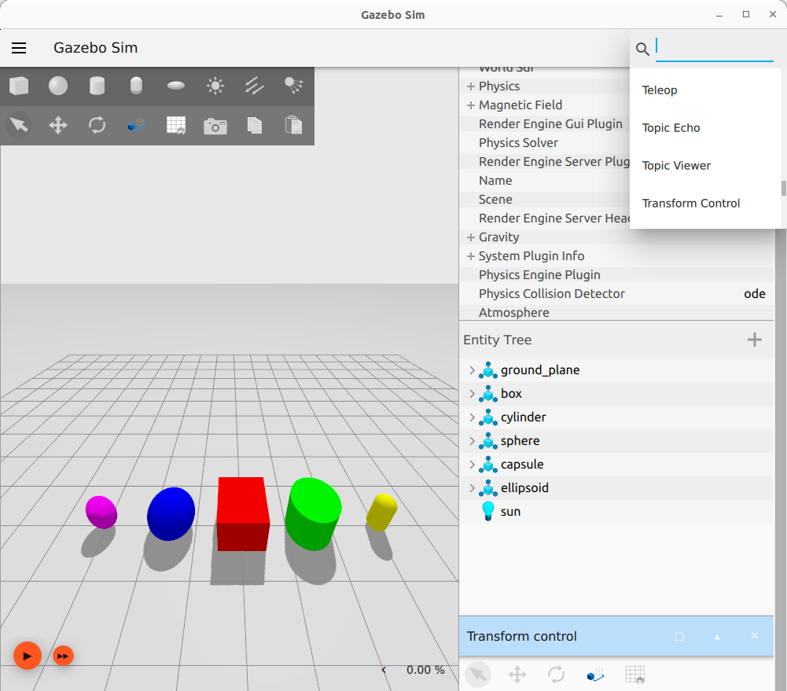
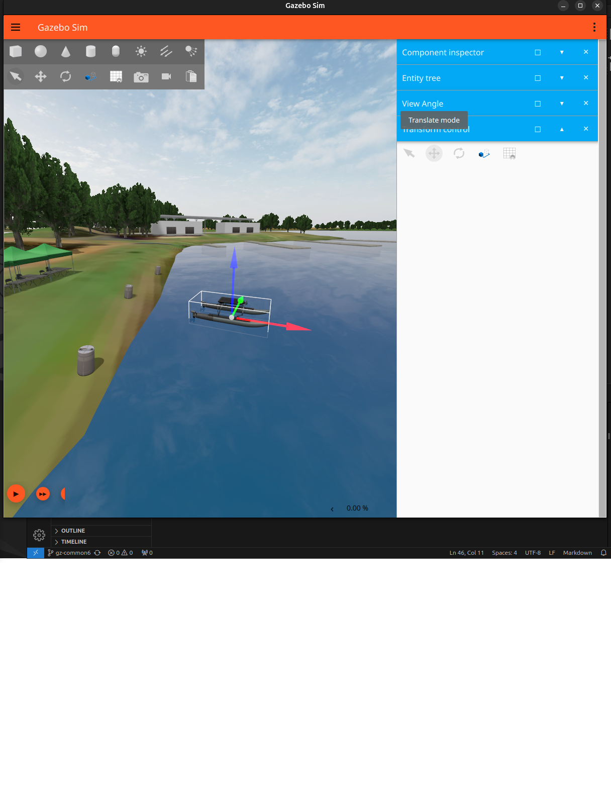

# Gazebo Ionic Test and Tutorial Party 2024: gz-sim: Create a surface vehicle #1287 

* Original ticket: https://github.com/gazebosim/gazebo_test_cases/issues/1287.

* **PLEASE** keep the [surface_vehicles.md](https://github.com/gazebosim/gz-sim/blob/gz-sim9/tutorials/surface_vehicles.md) open along side with this ```README.md``` as I am skipping some descriptions in favor of enabling completion of this tutorial repeatable.

* Tutorial for creating a maritime-surface vehicle in Gazebo 8: https://gazebosim.org/api/sim/8/surface_vehicles.html

* To see the vehicle with bouyancy and hydrodynamics set: ```TODO```

# Setup gz_maritime_ws and test Sydney Regatta Center world.

* Install and source ```workspace``` from [Source Install on Ubuntu](https://github.com/gazebosim/docs/blob/master/ionic/install_ubuntu_src.md) tutorial.

* Source that workspace ```source ~/workspace/install/setup.bash``` and test. Run this command ```gz sim --version``` and the following output should come out

```bash
Gazebo Sim, version 9.0.0~pre1
Copyright (C) 2018 Open Source Robotics Foundation.
Released under the Apache 2.0 License.
```

* Downloand and unzip the ```gz_maritime_ws```
```bash
wget https://raw.githubusercontent.com/gazebosim/gz-sim/gz-sim8/tutorials/files/surface_vehicles/gz_maritime_ws.zip -O ~/gz_maritime_ws.zip

unzip ~/gz_maritime_ws.zip
```

* Build and source ```gz_maritime_ws```
```bash
cd ~/gazebo_maritime_ws
colcon build --merge-install
source ./install/setup.bash
```

* Export these variables
```bash
export GZ_SIM_RESOURCE_PATH=$GZ_SIM_RESOURCE_PATH:~/gazebo_maritime_ws/install/share/gazebo_maritime/models
export GZ_SIM_SYSTEM_PLUGIN_PATH=$GZ_SIM_SYSTEM_PLUGIN_PATH:~/gazebo_maritime_ws/install/lib
export LD_LIBRARY_PATH=$LD_LIBRARY_PATH:~/gazebo_maritime_ws/install/lib
```
* Without these exports error such as ```unable to find uri(coast_waves)``` will occur

* Open the Sydney Regatta Center: ```gz sim -r src/gazebo_maritime/worlds/sydney_regatta.sdf```

# Spwan the Wave Adaptive Modular Vehicle (WAM-V)

* Some examples of WAM-V vehicles: https://wam-v.com/

* Activate the wam-v vehicle in ```sydney_regatta.sdf``` by uncommenting the following lines
```xml
<!-- Uncomment this block to load the WAM-V model-->
<include>
  <name>wam-V</name>
  <pose>-532 162 0 0 0 1</pose>
  <uri>wam-v</uri>
</include>
```

* Launch gazebo and watch the boat sink!: ```gz sim src/gazebo_maritime/worlds/sydney_regatta.sdf```

* Visulize the vehicle's **reference frame** as shown below

    * Activate ```Transform Control``` from the drop down as shown below
    

    * Click on the model and visualize transform frame as shown below
    

# Activate buoyancy, hydrodynamics and thrust

In ```~/gazebo_maritime_ws/src/gazebo_maritime/models/wam-v/model.sdf``` file activate all the commented out code blocks ```left thruster```, ```right thruster```, ```buoyancy``` on both left and right hulls and ```hydrodynamics```

# Rebuild pacakge and run simulator

```bash
colcon build --merge-install
gz sim -r src/gazebo_maritime/worlds/sydney_regatta_wamv.sdf
```